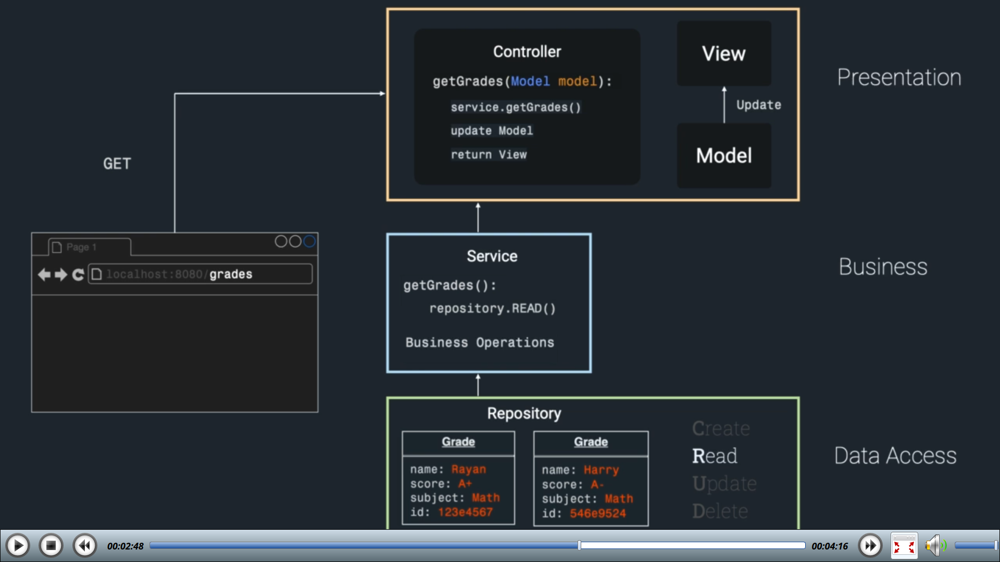

# Java Spring Boot

- **Group ID:** Identifies the organization. Example: com.google
- **Artifact ID:** Determines the name of the application.

## Three layers architecture

This architecture considers:

- Presentation layer (model + view + controller)
- Business logic (service): it has all the business operations (computation and
  decision making processes)
- Data access layer (repository): it has all the CRUD operations.

## Best practices and Notes

- Never ever create an object inside of a class that depends on it. This is
  called tight coupling and makes unite testing impossible. Instead, use
  dependency injection.
- `@Component` annotation is too generic. Use `@Service` for business logic
  layer and `@Repository` for the data access layer instead. They all turn a
  `class` into a `Bean`. `@Controller` also derives from `@Component`.
- `@Configuration` marks a class as a source of `Beans` definitions.
- `@Autowired` wires the class into the `Bean` that needs it.
- `@RestController` = `@Controller` + `@ResponseBody`. `@ResponseBody` converts
  the output to `JSON`.

